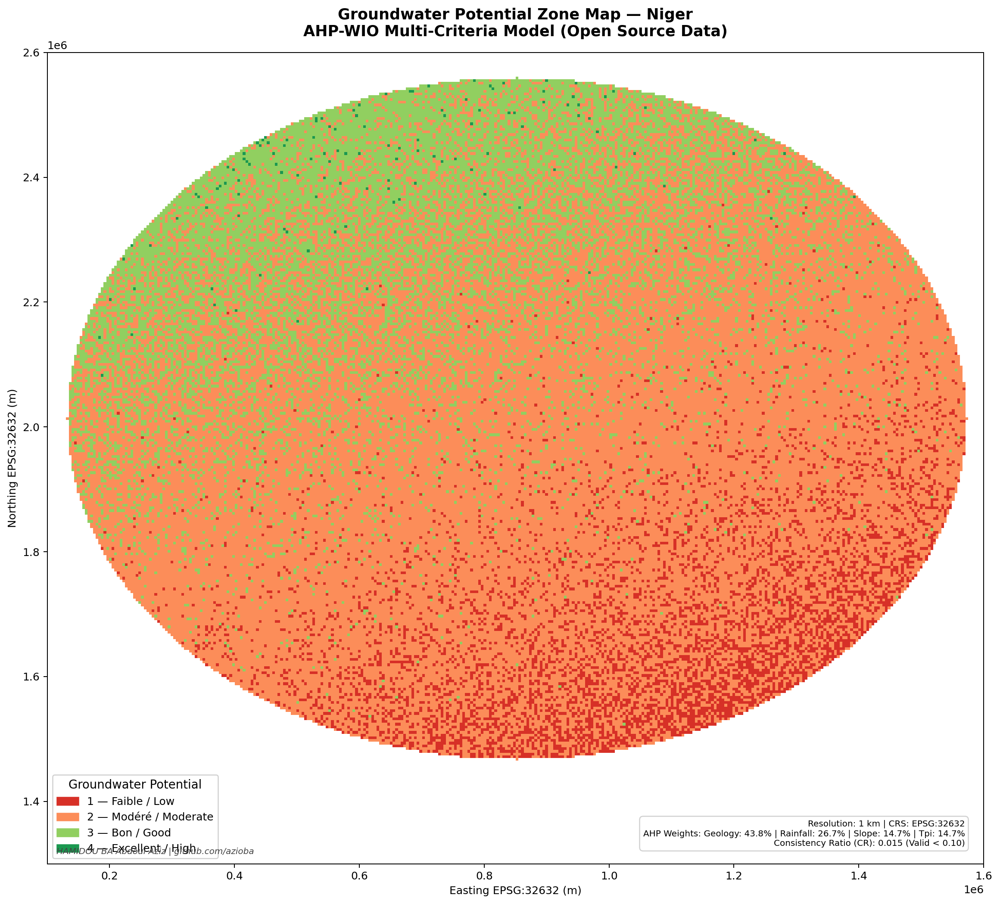
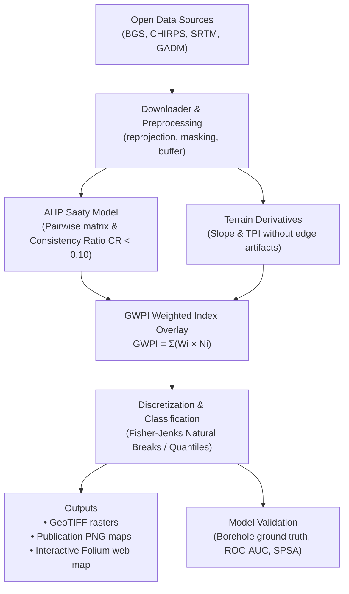

# 🌍 Hydrogeological Potential Mapping

> **Open-source toolkit for groundwater potential zone mapping at national scale**  
> Built with Python · Open Data Only · Fully Reproducible · Scientifically Grounded

[](LICENSE)
[](https://www.python.org/downloads/)
[]()
[]()

---

## 📌 What is this?

This repository provides a **complete, modular, and reusable Python pipeline** to map groundwater potential zones using the **Analytic Hierarchy Process (AHP)** and **Weighted Index Overlay (WIO)** — the international benchmark in hydrogeological remote sensing and GIS literature.

Originally developed for **Niger (West Africa)** as a case study, the codebase is completely decoupled from local hardcoded paths: it can be **adapted to any country** simply by editing a YAML configuration file (`config/config_template.yaml`).

**🌐 Live Interactive Demo (Niger):** [azioba.github.io/niger-hydrogeologie](https://azioba.github.io/niger-hydrogeologie)

---

## 🗺️ Example Output

| Groundwater Potential Map — Niger |
|:---------------------------------:|
|  |

*Groundwater potential map at 1 km resolution combining Geology, Rainfall, Slope, and Topographic Position Index (TPI) with boundary-artifact elimination and Fisher-Jenks classification.*

---

## 🏗️ Architecture & Workflow



---

## ⚡ Quickstart

### 1. Clone the repository

```bash
git clone https://github.com/azioba/hydrogeological-potential-mapping.git
cd hydrogeological-potential-mapping
```

### 2. Install dependencies

```bash
pip install -r requirements.txt
# Or install in editable mode:
pip install -e .
```

### 3. Run automated unit tests

```bash
pytest tests/ -v
```

### 4. Download open data

| Layer | Source | Format | Method |
|-------|--------|--------|--------|
| 🗺️ Administrative boundaries | [GADM](https://gadm.org) | `.gpkg` | Automated in `01_data_download_and_prep.ipynb` |
| 🌧️ Rainfall | [CHIRPS](https://www.chc.ucsb.edu/data/chirps) | `.tif` | Automated in `01_data_download_and_prep.ipynb` |
| 🪨 Hydrogeology | [BGS Africa Groundwater Atlas](https://www.bgs.ac.uk/africagroundwateratlas/) | `.shp` | Free country shapefiles |
| ⛰️ Elevation (DEM) | [HydroSHEDS / SRTM](https://www.hydrosheds.org) | `.tif` | 3 arc-sec global DEM |
| 💧 Boreholes (Optional) | [Water Point Data Exchange (WPDx)](https://www.waterpointdata.org) | `.csv` | National validation data |

---

## 🔬 Methodology & Key Innovations

### 1. Saaty's Analytic Hierarchy Process (AHP)
Instead of arbitrary weights, the model derives criteria weights using pairwise comparison matrices (Saaty 1980) and verifies the **Consistency Ratio (CR)**:

\[
CR = \frac{CI}{RI} < 0.10
\]

Default matrix for Niger (`config/config_niger.yaml`):

| Criteria | Geology | Rainfall | Slope | TPI | Weight (\(W_i\)) |
|:---|:---:|:---:|:---:|:---:|:---:|
| **Geology (BGS)** | 1 | 2 | 3 | 3 | **43.8%** |
| **Rainfall (CHIRPS)** | 1/2 | 1 | 2 | 2 | **26.7%** |
| **Slope (SRTM)** | 1/3 | 1/2 | 1 | 1 | **14.7%** |
| **TPI (SRTM)** | 1/3 | 1/2 | 1 | 1 | **14.7%** |

*Consistency Ratio: \(CR = 0.015\) (highly consistent, valid \(< 0.10\)).*

### 2. Boundary Artifact Elimination
Traditional GIS pipelines that mask rasters to national borders prior to calculating gradients produce severe artificial slopes at the borders (e.g. abrupt drops from 400m to 0m). This toolkit computes terrain derivatives with **buffer handling and NaN-aware spatial convolution** to guarantee physically accurate slopes and TPI values across the entire territory.

### 3. Classification: Fisher-Jenks Natural Breaks
While standard quartiles arbitrarily force 25% of any country into "Excellent" potential (unrealistic in arid/desert areas like the Sahara), this toolkit implements **Fisher-Jenks Natural Breaks** to group pixels according to natural clustering in data variance.

### 4. Ground-Truth Validation (ROC-AUC & Sensitivity)
Includes statistical validation tools:
- **ROC Curve & AUC Score**: Validates model predictions against borehole yields (\(m^3/h\)) or productive water points.
- **Single-Parameter Sensitivity Analysis (SPSA)**: Compares theoretical AHP weights against effective spatial weights.
- **Map Removal Sensitivity Analysis (MRSA)**: Measures map stability upon removing individual thematic layers.

---

## 📁 Repository Structure

```text
hydrogeological-potential-mapping/
├── .gitignore                                # Excludes heavy rasters, vectors and temporary caches
├── LICENSE                                  # Official MIT License
├── pyproject.toml                           # Package configuration and pip dependencies
├── requirements.txt                         # Pinned pip dependencies
├── README.md                                # Project documentation
├── config/
│   ├── config_niger.yaml                    # Full configuration for Niger (CRS, BGS codes, AHP)
│   └── config_template.yaml                 # Generic template to adapt to any country
├── src/
│   └── hydromap/                            # Core Python package
│       ├── __init__.py                      # Package entry point
│       ├── ahp.py                           # Saaty pairwise matrix, weights & CR calculation
│       ├── terrain.py                       # Slope, TPI, robust normalization (no edge artifacts)
│       ├── overlay.py                       # Weighted overlay (GWPI) & Fisher-Jenks classification
│       ├── downloader.py                    # Automated open-data downloads (GADM, CHIRPS)
│       ├── validation.py                    # ROC curve, AUC score, SPSA/MRSA sensitivity
│       └── visualizer.py                    # Publication Matplotlib maps & Folium interactive web map
├── notebooks/
│   ├── 01_data_download_and_prep.ipynb      # Step 1: Data download & workspace initialization
│   ├── 02_hydrogeological_mapping.ipynb     # Step 2: Full AHP-WIO processing pipeline
│   ├── 03_interactive_folium_map.ipynb      # Step 3: Interactive Folium web map generation
│   └── 04_model_validation_roc.ipynb        # Step 4: Statistical validation & sensitivity
├── tests/
│   ├── test_ahp.py                          # Unit tests for AHP model and consistency checks
│   ├── test_terrain.py                      # Unit tests for slope & TPI algorithms
│   ├── test_overlay.py                      # Unit tests for GWPI calculations and classification
│   └── test_validation.py                   # Unit tests for ROC-AUC and sensitivity metrics
├── outputs/
│   └── maps/
│       └── groundwater_potential_niger.png  # High-resolution output map
└── hydrogeological_potential_mapping.ipynb  # Root pipeline notebook (backward compatible)
```

---

## 📓 Notebooks Guide

| Notebook | Description |
|:---|:---|
| [`01_data_download_and_prep.ipynb`](notebooks/01_data_download_and_prep.ipynb) | Automated download of GADM boundaries and CHIRPS rainfall grids. |
| [`02_hydrogeological_mapping.ipynb`](notebooks/02_hydrogeological_mapping.ipynb) | End-to-end processing with AHP, artifact-free terrain analysis, and Jenks classification. |
| [`03_interactive_folium_map.ipynb`](notebooks/03_interactive_folium_map.ipynb) | Exportable interactive web map (Folium/Leaflet) for GitHub Pages. |
| [`04_model_validation_roc.ipynb`](notebooks/04_model_validation_roc.ipynb) | Quantitative validation with borehole data, ROC curve, AUC, and SPSA analysis. |
| [`hydrogeological_potential_mapping.ipynb`](hydrogeological_potential_mapping.ipynb) | Standalone root notebook with relative paths and modernized algorithms. |

---

## 🌍 Adapting to Another Country

To run this pipeline on another country:
1. Copy `config/config_template.yaml` to `config/config_mycountry.yaml`.
2. Update the ISO code, target projected UTM CRS (find yours at [epsg.io](https://epsg.io)), and BGS hydrogeology column codes.
3. Run `notebooks/02_hydrogeological_mapping.ipynb`.

---

## 📚 Scientific References

- **Saaty, T. L. (1980)** — *The Analytic Hierarchy Process*. McGraw-Hill, New York.
- **Andualem, T. G., & Demeke, G. G. (2020)** — *Groundwater potential mapping using geospatial techniques*. [Cogent Geoscience, 6(1)](https://www.tandfonline.com/doi/full/10.1080/24749508.2020.1728882).
- **Hussein, A. A. et al. (2021)** — *Groundwater Potential Zone Mapping Using AHP and GIS in Arid Regions*. [PMC8727729](https://pmc.ncbi.nlm.nih.gov/articles/PMC8727729/).
- **BGS Africa Groundwater Atlas** — British Geological Survey, [africagroundwateratlas](https://www.bgs.ac.uk/africagroundwateratlas/).

---

## 👤 Author

**HAMIDOU BÂ Abdoul Aziz**  
Geologist · Product Owner · Data Scientist  

[](https://www.linkedin.com/in/azioba)
[](https://github.com/azioba)

---

## 📄 License

This project is licensed under the MIT License — see the [LICENSE](LICENSE) file for details.
Free to use, adapt and share with attribution.

```bibtex
@software{hamidouba2026hydromap,
  author = {HAMIDOU BÂ Abdoul Aziz},
  title = {Hydrogeological Potential Mapping — Open Source Pipeline},
  year = {2026},
  publisher = {GitHub},
  url = {https://github.com/azioba/hydrogeological-potential-mapping}
}
```
